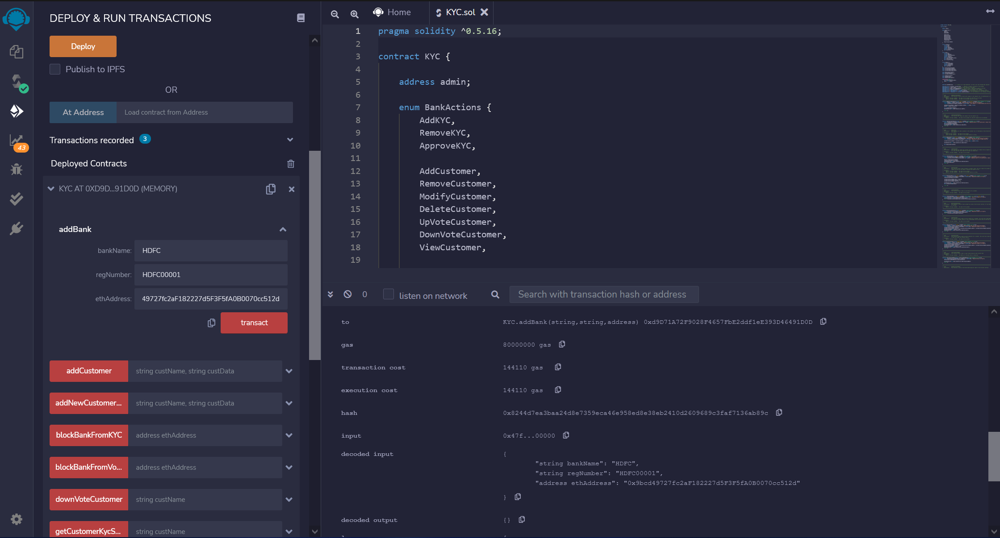

# KYC Verification (Blockchain)
 \
**Description** \
Decentralized KYC verification process for banks that stores customer data in a blockchain. A distributed ledger is set up among all the banks, where one bank can upload the KYC of a customer and others can vote on the legitimacy of the customer’s details. The KYC for the customers will be stored immutably on the blockchain and will be accessible to all the banks in the blockchain. \
***The smart contracts are written in Solidity programming language and deployed on a private ethereum network using Truffle.*** 

-----
***Install Dependencies (Commands for macOS; Make sure to have latest versions of Homebrew and Node/npm):*** 

>**Geth (go-ethereum)** \
*$ brew tap ethereum/ethereum* \
*$ brew install ethereum*

>**Truffle** \
*$ sudo npm install -g truffle*

>**Solidity** \
*$ sudo npm install -g solc*

-----
***Steps to set up a private ethereum network:***
>**Step 1**   \
*$ geth --datadir EthNetwork init genesis.json* (Inside the EthNetwork Folder which contains genesis.json) 

>**Step 2**   \
*$ geth --port 3000 --networkid 2023 --nodiscover --datadir=./EthNetwork --maxpeers=0  --rpc --rpcport 8545*

Network with an id of 2023 will start after execution of the above commands.

-----
***Create an account for each bank and start the mining process:***
>**For example, take HDFC Bank** \
*personal.newAccount("HDFC")* \
*personal.unlockAccount(web3.eth.coinbase, "HDFC", 15000)*

**To start the mining process,**
> *miner.start()*

**To stop the mining process,** 
> *miner.stop()*
-----
***Compile the smart contract in Truffle and deploy it to the private blockchain created:*** \
*Inside the Truffle folder which contains the contracts and migrations, run the following commands* 
>*$ truffle compile* \
*$ truffle migrate*
-----
## Smart Contract deployed using Remix IDE: 

-----
